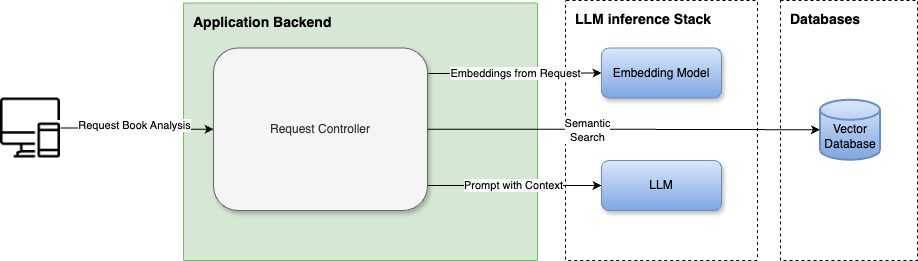

## High-level Cloud Architecture


#### Keyword-driven Analysis


Install the latest python interpreter with the pyenv for the simplest installation:
```shell
sudo apt-get update 
sudo apt-get install -y build-essential zlib1g-dev libncurses5-dev libncursesw5-dev libreadline-dev libsqlite3-dev libssl-dev libffi-dev libbz2-dev
# If you get an error  about “p_config not found”
sudo apt-get install libpq-dev
curl https://pyenv.run | bash
echo -e 'export PYENV_ROOT="$HOME/.pyenv"\nexport PATH="$PYENV_ROOT/bin:$PATH"' >> ~/.bashrc
echo -e 'eval "$(pyenv init --path)"\neval "$(pyenv init -)"' >> ~/.bashrc
pyenv --version
```

Install the python 3.12 and confirm it as the default:
```shell
pyenv install 3.12.4
pyenv global 3.12.4
python3 -m venv .venv #check notification in vscode and click click yes
```

Run the App locally:
```shell
gcloud auth login
gcloud config set project $your_project_id

#set the PROJECT_ID env variable
export PROJECT_ID=$(gcloud config list --format 'value(core.project)')

python -V
pip install -r requirements.txt
source .env.example
python /home/user/python-django-docker/src/manage.py runserver 8000

#endpoints to test:
#host:8000/
#host:8000/up
#host:8000/up/status
````

run tests:
```shell
export PYTHONPATH=$PYTHONPATH:/home/user/python-django-docker/src
export DJANGO_SETTINGS_MODULE=config.settings
python tests/view_tests.py
````

run tests in intellji test configuration:
PYTHONUNBUFFERED=1;PYTHONDONTWRITEBYTECODE=true;WEB_CONCURRENCY=1;WEB_RELOAD=true;DEBUG=true;POSTGRES_HOST=0.0.0.0;POSTGRES_PASSWORD=pword;POSTGRES_PORT=5000;GOOGLE_CLOUD_PROJECT_ID=next24-genai-app
```shell
#setup the following environment variables to the run configurations in vscode:
export PYTHONPATH=$PYTHONPATH:/home/user/python-django-docker/src;DJANGO_SETTINGS_MODULE=config.settings
export PYTHONUNBUFFERED=1
export PYTHONDONTWRITEBYTECODE=true
export WEB_CONCURRENCY=1 
export WEB_RELOAD=true
export DEBUG=true 
export POSTGRES_HOST=0.0.0.0 
export POSTGRES_PASSWORD=pword 
export POSTGRES_PORT=5432
export GOOGLE_CLOUD_PROJECT_ID=$PROJECT_ID
```

run docker container locally:
```shell
#set the project if you haven't already
gcloud config set project $your_project_id>
export PROJECT_ID=$(gcloud config list --format 'value(core.project)')
docker build -f ./Dockerfile -t django .

docker run --rm -p 8000:8000 \
  -e PYTHONDONTWRITEBYTECODE=true \
  -e WEB_CONCURRENCY=1 \
  -e WEB_RELOAD=true \
  django

docker run --rm -p 8000:8000 \
  -e PYTHONDONTWRITEBYTECODE=true \
  -e WEB_CONCURRENCY=1 \
  -e WEB_RELOAD=true \
  -e POSTGRES_HOST=0.0.0.0 \
  -e POSTGRES_PASSWORD='pword' \
  -e POSTGRES_PORT=5000 \
  -e GOOGLE_CLOUD_PROJECT_ID=$PROJECT_ID \
  django:latest
 ```

Run container image build with Cloud Build (will pick up cloudbuild.yaml):
```shell
#set the project if you haven't already
gcloud config set project $your_project_id>
#set the PROJECT_ID env variable
export PROJECT_ID=$(gcloud config list --format 'value(core.project)')
echo $PROJECT_ID
gcloud builds submit --machine-type E2-HIGHCPU-32
```

allow unauthenticated policy for cloudrun:
```shell
gcloud resource-manager org-policies set-policy policy.yaml --organization=$ORG_ID
```
Deploy Cloud Run to your GCP project:
```shell
gcloud run deploy django \
  --image us-central1-docker.pkg.dev/$PROJECT_ID/django/django-app:latest \
  --region us-central1 \
  --set-env-vars="PYTHONDONTWRITEBYTECODE=true,PYTHONUNBUFFERED=1,POSTGRES_HOST=0.0.0.0,POSTGRES_PASSWORD=pword,GOOGLE_CLOUD_PROJECT_ID=${$PROJECT_ID}" \
  --memory 2Gi \
  --allow-unauthenticated \
  --vpc-connector alloy-connector
```

*Note For access to vertexai api locally you need to authenticate to gcp via gcloud auth login or use sa key:

Using sa key e.g.
```shell
export GOOGLE_APPLICATION_CREDENTIALS=/home/user/sa.json
```

Collect to alloydb from local
```shell
#https://cloud.google.com/alloydb/docs/auth-proxy/connect#command-line
./alloydb-auth-proxy "projects/project/locations/us-central1/clusters/alloydb-aip-01/instances/alloydb-aip-01-pr" --credentials-file "/Users/user/sa.json" --public-ip
```